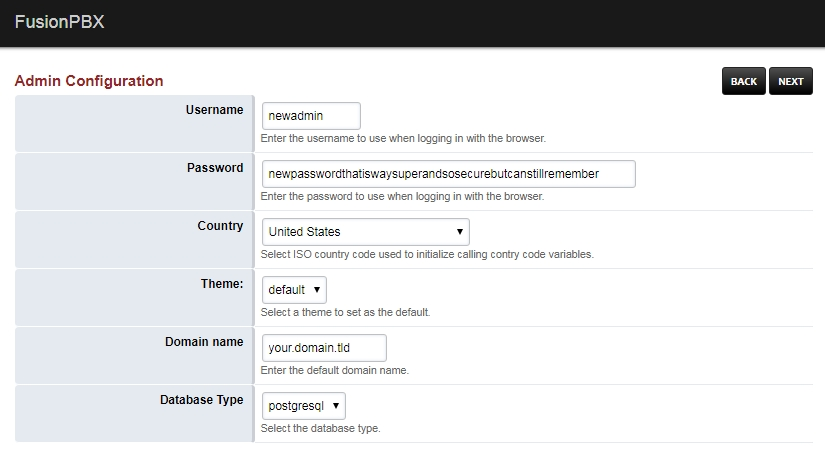
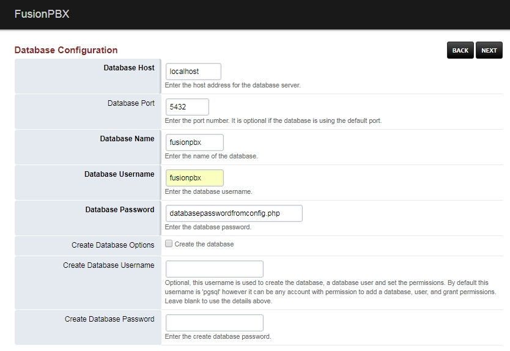

#######################
Password Reset
#######################

`Click here for the new youtube video on password recovery. <https://youtu.be/YrlfscQ_3ew>`_ 

.. raw:: html

    

    <iframe width="100%" height="350" src="https://www.youtube.com/embed/YrlfscQ_3ew?rel=0" frameborder="0" ; encrypted-media" allowfullscreen></iframe>
    

The current method to changing the superadmin password is actually to make a new superadmin user name and password.

.. note::
       In older installations of IungoPBXPBX config.php is located in /var/www/iungopbx/resources/

1. Move the config.php file temporarily.

::
 cat /etc/iungopbx/config.php | grep password
 cd /etc/iungopbx
 mv config.php config.backup.php

|
2. Go to the IungoPBXPBX install login page in the web browser.  This will put IungoPBXPBX into a recovery mode. **click next.**

.. note::

 You will type in your web browser either the ip hxxps://xxx.xxx.xxx.xxx or  the domain name hxxps://sub.domain.tld .
 

3.  In this step, you create what you want for the new superadmin user and password.  It has to be a user and password that **does not already exist.**

4. Database Host, Database Port, Database name should be pre filled.  To provide the Database Username and Database Password you will have to locate those in the config.php file that we moved eariler. The code block below shows an easy way to retrieve the database password. Once those are filled in click **next.**

::
 
 cd /etc/iungopbx
 cat config1.php | grep password
        $db_password = 'databasepasswordfromconfig.php';

5. You should have a new config.php file in the /etc/iungopbx/  directory.  Proceed to login to with the new superadmin user name and password.

