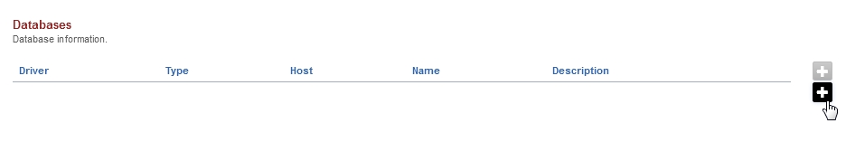

###################
Databases
###################

Database information.  Most IungoPBXPBX installs use Postgresql for IungoPBXPBX and SQLite for the switch.  This section is for edge case installs.

