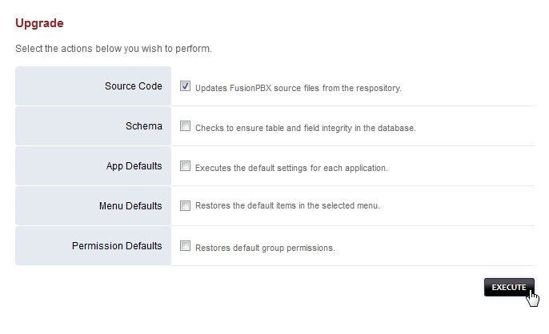
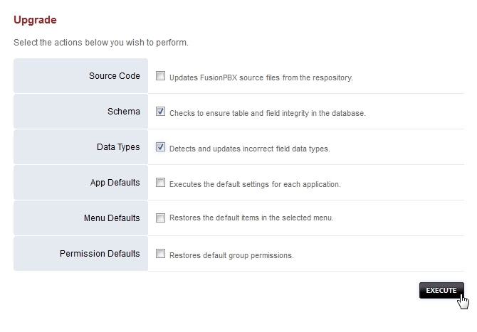

**********
Upgrade
**********

If you are looking to upgrade your current `version of IungoPBXPBX to the next release version click here <http://docs.iungopbx.com/en/latest/advanced/version_upgrade.html>`_.

The IungoPBXPBX code is constantly evolving.

*  Bug fixes being submitted
*  Additions to improve security
*  Making IungoPBXPBX look nicer
*  More flexible
*  More scalable
*  New features

A complete summary of the changes can be found on the github code page https://github.com/iungopbx/iungopbx/commits/master.  

Go to the menu then click on Advanced and then Upgrade. This tool allows you to update the source code, update the database structure, restore the default menu and  permissions. `Click here for the Youtube video <https://youtu.be/QUB3u9pZ7ks>`_.

.. raw:: html

    

    <iframe width="100%" height="350" src="https://www.youtube.com/embed/QUB3u9pZ7ks?rel=0" frameborder="0" ; encrypted-media" allowfullscreen></iframe>
    

|

| **Update the source from command line**

::

 * cd /var/www/iungopbx 
 git pull
 chown -R www-data:www-data *

| **Back to the GUI**

::

 *Upgrade Database with advanced -> upgrade schema
 *Update permissions
 *Update the menu
 *Logout and back in

How to Upgrade
##############

|

| To upgrade you will need to get the latest source code. Depending on how extreme the changes have been or the version you currently are on since your last update, you may need to follow version specific upgrade instructions to bring your install up to date.

**Step 1: Update IungoPBXPBX Source**
^^^^^^^^^^^^^^^^^^^^^^^^^^^^^^^^^^^

| 1. GUI -> Advanced -> Upgrade (doesn't update all files)

Used to update IungoPBXPBX to the latest release.

**Upgrade the code via Github/GIT**

| Login into the web interface with a user account assigned to the superadmin group.
| Login to the console with either the ssh, the locally.
| Backup It's a good idea to make a backup. If using sqlite, your backup will easily include the SQL database.
 
::

 mkdir /etc/iungopbx
 mv /var/www/iungopbx/resources/config.php /etc/iungopbx
 mv /usr/local/freeswitch/scripts/resources/config.lua /etc/iungopbx
 cd /var/www
 cp -R iungopbx iungopbx_backup
 Change the directory''' to the IungoPBXPBX directory
 cd /var/www/iungopbx

**Update the source code** (example assumes iungopbx is in /var/www/iungopbx)
 
::

 cd /var/www/iungopbx
 git pull
 
| **Permissions**
| Reset the permissions on the iungopbx directory tree. When you do **git pull** it sets the permissions on any updated files to match the account that you are running **git pull** with. If that account is different to the web server account it will result in some files no longer being accessible and a red bar error at the top of the upgrade screen on the GUI.  To fix this you should reapply the permissions in iungopbx and recursively in all directories inside it.
|
| The example assumes the web server runs as user 'www-data' and iungopbx is installed to /var/www/iungopbx. (chown -Rv Ownername:GroupName /var/www/iungopbx)

::

 cd /var/www/iungopbx
 chown -R www-data:www-data *

**Step 2: Update Freeswitch Scripts**
^^^^^^^^^^^^^^^^^^^^^^^^^^^^^^^^^^^^^^

| NOTE: As of IungoPBXPBX 3.8.3 (Stable Branch), the scripts should be automatically updated when updating the Source Code, using the **Advanced > Upgrade** page. Any customized scripts, having the same name as the default scripts, **will be overwritten.** (An option to disable this default behavior is available using **Default Setting: switch > scripts_update > false**) Missing scripts will be restored, and any additional files within the scripts folder will remain untouched.

| IungoPBXPBX is a fast moving project where features are constantly being added and bugs are being fixed on a daily basis so I would also suggest upgrading the Freeswitch scripts directory as part of any normal upgrade process.

**Update Freeswitch** 

| Use github to get the updated files. **You have to do this from an empty directory**.
 
::

 cp -R /usr/local/freeswitch/scripts /usr/local/freeswitch/scripts-bak
 rm -Rf /usr/local/freeswitch/scripts/
 cd /usr/src
 git clone https://github.com/iungopbx/iungopbx.git
 cp -R /var/www/iungopbx/resources/install/scripts /usr/local/freeswitch
 chown -R www-data:www-data /usr/local/freeswitch/scripts
 cp -R /usr/local/freeswitch/scripts-bak/resources/config.lua /usr/local/freeswitch/scripts/resources/config.lua

(The last step above is not required if your config.lua file is being stored in a different location, such as the /etc/iungopbx folder.)

| **Clean out this scripts directory**
| An alternative is to remove the Lua scripts. **Only do this if you haven't customized any LUA scripts**

::

 cp -R /usr/local/freeswitch/scripts /usr/local/freeswitch/scripts-bak
 rm -rf /usr/local/freeswitch/scripts/*

| **Pull the most recent scripts down**

| Here you need to go directly to step 3 and make sure you run upgrade schema from the GUI immediately otherwise your calls will not complete.

| **Restore the config.lua file (IMPORTANT!!)**

| If your config.lua file was located in scripts/resources/, then you'll need to restore it (from the backup previously performed) to scripts/resources/config.lua.

**Step 3: Upgrade Schema**
^^^^^^^^^^^^^^^^^^^^^^^^^^^^^

| Many updates have changes to the database and to the Freeswitch scripts. The upgrade_schema script 

| **Upgrade from the GUI** 

| From the GUI, run **Advanced -> Upgrade Schema** which will add any needed newer tables or columns.
| Then run **App Defaults**. *If you removed the scripts on Step 2 then run this* **twice**.

|

| **Upgrade from the Command Line**
| An alternative to running upgrade_schema.php from the GUI is to run the upgrade.php from the command line. It was designed to make the upgrade easier. If you did not login when updating the IungoPBXPBX source code then you will need to run the upgrade.php file from the command line. Make sure to use the full path to the PHP file.

| As root run the following
 
::
 
 cd /var/www/iungopbx
 /usr/bin/php /var/www/iungopbx/core/upgrade/upgrade.php

| If your screen was nicely formatted with a iungopbx theme, and suddenly now goes to a black and white screen with familiar text but no theme, it is because you were using a theme which no longer exists in the latest version of the code.  If this happens to you navigate to:

::

 http://domain_or_ip/mod/users/usersupdate.php
 
| Then scroll down to where it says **"Template"** and select one of the valid templates from the drop down list.  Then press Save.  It will be fixed now and you can continue with the remaining steps below.
| (Note that any users who have invalid templates selected will also have the same problem you did. You can fix them from the user manager option in the accounts menu)

**Step 4: Apply permissions and Restart Freeswitch**
^^^^^^^^^^^^^^^^^^^^^^^^^^^^^^^^^^^^^^^^^^^^^^^^^^^^^

| **Make sure that the freeswitch directory has the correct permissions**

::

 chown -Rv www-data:www-data /usr/local/freeswitch/

| **Restart Freeswitch**

::

 systemctl restart freeswitch

**Step 5: Menu**
^^^^^^^^^^^^^^^^^

| Needed if your menu disappeared.
| **v1 and v2**
| Now update the menu to the latest version.

::

 http://domain_or_ip/core/menu/menu_restore_default.php

| Press 'Restore Default' on the top right.
| **v3**
| https://your.ip/core/menu/menu.php
| click 'e' next to the default menu
| click the restore default button.
| https://your.ip/logout.php
| https://your.ip/login.php

**Step 6: Re-generate Settings**
^^^^^^^^^^^^^^^^^^^^^^^^^^^^^^^^

| Sometimes variable names changes. In rev 1877 **v_config_cli.php** variable names changed which caused no fax to email emails or voicemail emails to be sent. Problem was the SMTP details did not exist.

| Go to **Advanced -> Settings** and then **click save**. This will re-generate v_config_cli.php and any other needs config files.

Move to a different Branch
###########################

IungoPBXPBX has a stable and a master(development) branch.  You can switch from stable to master but **not recomended to downgrade.** 

**Move to the Stable Branch**
^^^^^^^^^^^^^^^^^^^^^^^^^^^^^^
::

 mv /var/www/iungopbx /var/www/iungopbx-old
 cd /var/www && git clone -b 4.4 https://github.com/iungopbx/iungopbx.git
 chown -R www-data:www-data /var/www/iungopbx

Make sure config.php exists in /etc/iungopbx If missing then move it into this directory.

::
 
 cp /var/www/iungopbx-master/resources/config.php /etc/iungopbx

**Move to the Master Branch**
^^^^^^^^^^^^^^^^^^^^^^^^^^^^^^^
::
 
 mv /var/www/iungopbx /var/www/iungopbx-old
 cd /var/www && git clone https://github.com/iungopbx/iungopbx.git
 chown -R www-data:www-data /var/www/iungopbx

*  Complete the normal upgrade process at Advanced -> Upgrade
*  If the menu disappears you have to upgrade schema then restore the default menu to get it back.

