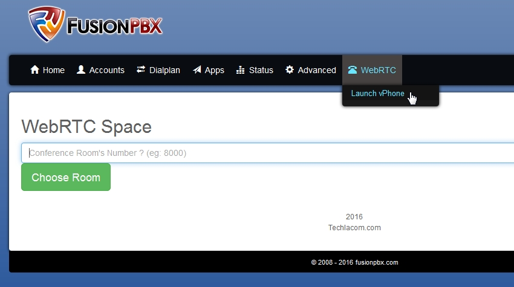

########
WebRTC
########

WebRTC app for IungoPBXPBX is made by editing an existing IungoPBXPBX app code and adding the code from the "Master FreeSWITCH code example".  Also, keep in mind that you will need ssl certs working on the server.

.. Note::

 There are two "sets" of code in this app. One being an existing app from IungoPBXPBX and the code example from `Master FreeSWITCH book`_ in Chapter 8.

Prerequisites
^^^^^^^^^^^^^^

* Working install of IungoPBXPBX
* Working set of SSL certs (Not self signed) on said install of IungoPBXPBX
* Working mod_verto setup.
* Patience

Install Steps
^^^^^^^^^^^^^^

On your server

::

  cd /usr/src
  git clone https://github.com/iungopbx/iungopbx-apps
  Move the directory 'webrtc' into your main IungoPBXPBX directory
  mv iungopbx-apps/webrtc /var/www/iungopbx/app
  chown -R www-data:www-data /var/www/iungopbx/app/webrtc

::

 Log into the IungoPBXPBX webpage
 Advanced -> Upgrade
 Menu Defaults and Permission Defaults.
 Log out and back in.

.. _Master FreeSWITCH book: https://www.packtpub.com/networking-and-servers/mastering-freeswitch
